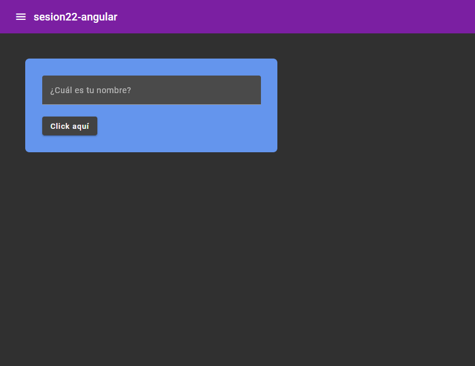
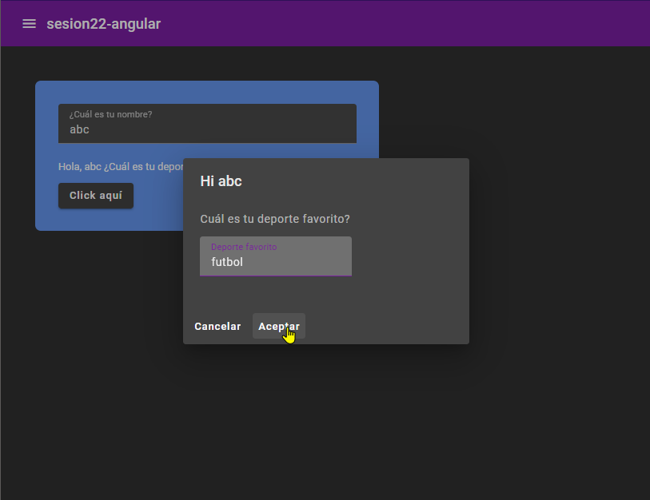

# Act24

componentes importantes: nav, act y box

<!-- <https://material.angular.io/guide/schematics>

ng generate @angular/material:navigation <component-name>

donde dice addcontent here, colocar el <routeroutlet>

ng generate @angular/material:table <component-name>

ng generate @angular/dashboard:table <component-name>

ng generate @angular/material:address-form <component-name> -->